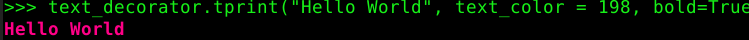

# consoleTools
Conjunto de herramientas para hacer los programas de consola mas amigables.

**[ES](https://github.com/SombraCancelada/consoleTools/README.MD)**
**[EN](https://github.com/SombraCancelada/consoleTools/README_en.MD)**

> python -m pip install --index-url https://test.pypi.org/simple/ --no-deps console-tools-SombraCancelada

## **¿Que es?**

#### Es una herramienta para agregar colores y estilos al texto mostrado en pantalla por consola, para los programas de linea de comandos, haciéndolos mas amigables con el usuario.

#### Los colores disponibles para el fondo del texto son: 
- `40`: 
- `41`: 
- `42`: 
- `43`: 
- `44`: 
- `45`: 
- `46`: 
- `47`: 

#### Los colores disponibles para el texto son:

## **¿Como Funciona?**

#### Se puede importar el modulo *console_tools.py* e instanciar la clase *TextDecorator*:
`text_decorator = TextDecorator()`
### Luego se puede acceder a cada una de las funciones medainte `text_decorator.`*`nombre_funcion`*.

### Las funciones disponbles son:

- ### `tprint(`text, bg\_color=None, text\_color=None, blink=False, underline=False, bold=False, italic=False`)`
> Imprime por pantalla un texto con estilos.

    - `text`: El texto para darle estilo.
    - `bg_color`: Color de fondo del texto ( numero entre 40 y 47 ).
    - `text_color`: Color del texto (numero entre 1 y 254)
    - `blink`: Booleano, establece si el texto parpadea.
    - `underline`: Booleano, establece si el texto está subrayado.
    - `bold`: Booleano, establece si el texto está en negritas.
    - `italic`: Booleano, establece si el texto es italic.
#### Ejemplos de uso función *tprint()*:
- `text_decorator.tprint("Hello World", text_color=226)`: 
- `text_decorator.tprint("Hello World", text_color=198, bold=True)`: 

- ### `get_decorators(`text, bg\_color=None, text\_color=None, blink=False, underline=False, bold=False, italic=False`)`
> Retorna un texto con estilos incluidos. 

    - `text`: El texto para darle estilo.
    - `bg_color`: Color de fondo del texto ( numero entre 40 y 47 ).
    - `text_color`: Color del texto
    - `blink`: Booleano, establece si el texto parpadea.
    - `underline`: Booleano, establece si el texto está subrayado.
    - `bold`: Booleano, establece si el texto está en negritas.
    - `italic`: Booleano, establece si el texto es italic.

> Los ejemplos de `get_decorators` son iguales a los de `tprint` pero con la diferencia que es necesario imprimir el resultado devuelto con `print(get_decorators())`

- ### `loader(`text, title="Loading", seconds=0.01, bg\_color=None, text\_color=None, blink=False, underline=False, bold=False, italic=False`)`
> Imprime una animacion de carga de procentaje del 1% - 100%. 

    - `title`: El titulo para mostrar antes de la carga.
    - `seconds`: El tiempo que tarda cada 1% de la carga.
    - `bg_color`: Color de fondo del texto ( numero entre 40 y 47 ).
    - `text_color`: Color del texto (numero entre 1 y 254)
    - `blink`: Booleano, establece si el texto parpadea.
    - `underline`: Booleano, establece si el texto está subrayado.
    - `bold`: Booleano, establece si el texto está en negritas.
    - `italic`: Booleano, establece si el texto es italic.
#### Ejemplos de uso funcion *loader()*:
- `text_decorator.loader(title="cargando...", seconds = 0.1, text_color=134)`: 

- ### `progress_bar(`text, title="Loading", seconds=0.01, bg\_color=None, text\_color=None, blink=False, underline=False, bold=False, italic=False`)`
> Imprime una animacion de carga como caracteres '#'. 

    - `title`: El titulo para mostrar antes de la carga.
    - `seconds`: El tiempo que tarda cada 1% de la carga.
    - `bg_color`: Color de fondo del texto ( numero entre 40 y 47 ).
    - `text_color`: Color del texto (numero entre 1 y 254)
    - `blink`: Booleano, establece si el texto parpadea.
    - `underline`: Booleano, establece si el texto está subrayado.
    - `bold`: Booleano, establece si el texto está en negritas.
    - `italic`: Booleano, establece si el texto es italic.
#### Ejemplos de uso funcion *progres_bar()*:
- `text_decorator.progress_bar(title="loading...", seconds = 0.05, text_color=134)`: 
