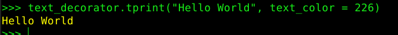
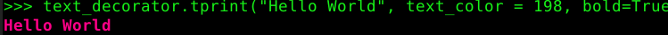
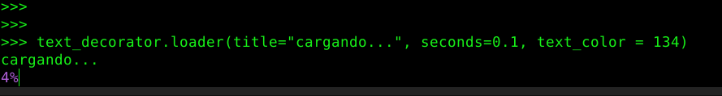
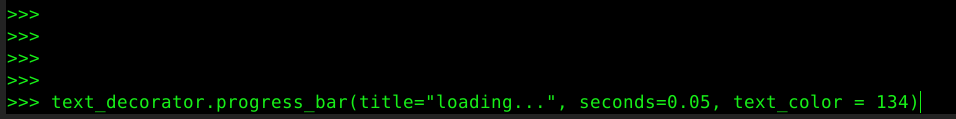

# consoleTools
Toolkit to make console programs more user friendly.

**[ES](/README.MD)**
**[EN](README_en.MD)**

> python -m pip install --index-url https://test.pypi.org/simple/ --no-deps console-tools-SombraCancelada

## **What is it?**

#### It's a tool to add colors and styles to the text displayed on the screen by the console, for the command line programs, making them more user friendly.

#### The available colors for the text background are: 
- `40`: 
- `41`: 
- `42`: 
- `43`: 
- `44`: 
- `45`: 
- `46`: 
- `47`: 

#### The available colors for the text are:
colors](readme/colores.png)

## How does it work?

#### You can import the *console_tools.py* module and instantiate the *TextDecorator* class:
`text_decorator = TextDecorator()`
### Then you can access each of the functions through `text_decorator.`*`function_name`*.

### The available functions are:

- ### `tprint(`text, bg\_color=None, text\_color=None, blink=False, underline=False, bold=False, italic=False`)`
> Print a text with styles on the screen.

    - `text`: The text to give style.
    - `bg_color`: Background color of the text ( number between 40 and 47 ).
    - `text_color`: Text color (number between 1 and 254)
    - `blink`: Boolean, sets whether the text blinks.
    - `Underline`: Boolean, sets if the text is underlined.
    - `Bold`: Boolean, sets if text is bold.
    - `Italic`: Boolean, sets if the text is italic.
#### Examples of use *tprint()* function:
- `text_decorator.tprint("Hello World", text_color=226)`: 
- `text_decorator.tprint("Hello World", text_color=198, bold=True)`: 

- ### `get_decorators(`text, bg\_color=None, text\_color=None, blink=False, underline=False, bold=False, italic=False`)`
> Returns a text with styles included. 

    - `text`: The text to style.
    - `bg_color`: Background color of the text ( number between 40 and 47 ).
    - `text_color`: Text color
    - `blink`: Boolean, sets whether the text blinks.
    - `Underline`: Boolean, sets if the text is underlined.
    - `Bold`: Boolean, sets if text is bold.
    - `Italic`: Boolean, sets if the text is italic.

> The examples for `get_decorators` are the same as those for `tprint` but with the difference that it is necessary to print the result returned with `print(get_decorators())`.

- ### `loader(`text, title="Loading", seconds=0.01, bg\_color=None, text\_color=None, blink=False, underline=False, bold=False, italic=False`)`
> Prints a percentage load animation of 1% - 100%. 

    - `title`: The title to display before the load.
    - `seconds`: The time it takes for each 1% of the load.
    - `bg_color`: The background color of the text ( number between 40 and 47 ).
    - `text_color`: Text color (number between 1 and 254)
    - `blink`: Boolean, sets whether the text blinks.
    - `Underline`: Boolean, sets if the text is underlined.
    - `Bold`: Boolean, sets if text is bold.
    - `Italic`: Boolean, sets if the text is italic.
#### Examples of use *loader()* function:
- `text_decorator.loader(title="loading...", seconds = 0.1, text_color=134)`: 

- ### `progress_bar(`text, title="Loading", seconds=0.01, bg\_color=None, text\_color=None, blink=False, underline=False, bold=False, italic=False`)`
> Prints a loading animation as '#' characters. 

    - `title`: The title to display before the loading.
    - `seconds`: The time it takes for each 1% of the load.
    - `bg_color`: Background color of the text ( number between 40 and 47 ).
    - `text_color`: Text color (number between 1 and 254)
    - `blink`: Boolean, sets whether the text blinks.
    - `Underline`: Boolean, sets if the text is underlined.
    - `Bold`: Boolean, sets if text is bold.
    - `Italic`: Boolean, sets if the text is italic.
#### Usage examples function *progres_bar()*:
- `text_decorator.progress_bar(title="loading...", seconds = 0.05, text_color=134)`: 

